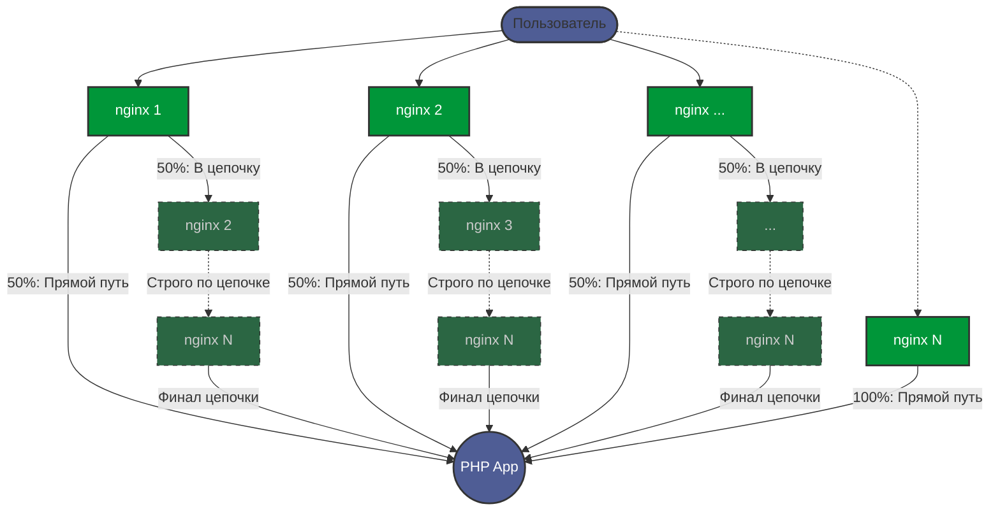

## Содержание

- [Что получилось?](#-что-получилось)
- [Установка и проверка на тестовом стенде](#-установка-и-проверка-на-тестовом-стенде)
- [Протокол тестирования](#-протокол-тестирования)
  - [Демонстрация работы скрипта проверки](#-демонстрация-работы-скрипта-проверки)
  - [Примеры выводов через curl](#-примеры-выводов-через-curl)
- [Структура проекта](#-структура-проекта)
- [Решение тестового задания и инструменты, которые я использовал](#-решение-тестового-задания-и-инструменты-которые-я-использовал)
  - [Как я интерпретировал ТЗ + допущения](#-как-я-интерпретировал-тз--допущения)
  - [Логика маршрутизации](#-логика-маршрутизации)
  - [Инструменты на стороне сервера (IaC)](#%EF%B8%8F-инструменты-на-стороне-сервера-iac)
  - [Инструменты для выполнения самого задания](#-инструменты-для-выполнения-самого-задания)
- [Автономная генерация стенда (Bash CLI)](#-автономная-генерация-стенда-bash-cli)
- [По времени](#%EF%B8%8F-по-времени)

## ✅ Что получилось?
<p align="right"><a href="#содержание">Наверх</a></p>

* Развернул полностью автономный тестовый стенд с nginx-нодами;
* На портах 8081, 8082 ... (8080+N) развернуты nginx-ноды (в конфиге по умолчанию взял N=5, порты=8080+N);
* В docker-compose файле nginx-ноды стартуют только после того, как развернется app;
* Если зайти на основной ip (порт 80), то попадаем на балансировщик, который очищает заголовки и перебрасывает нас на случайный nginx-сервер;
* Если зайти напрямую на ip:port ноды, то с вероятность 50/50 мы попадем сразу на app или уйдем по цепочке до конца;
* Если сделать запрос на ip:port/json.php - бэкенд вернет ответ сразу в виде JSON с одним чистым значением X-Forwarded-For (удобно для автоматизированного парсинга);
* Если сделать запрос на ip:port/read.php - бэкенд вернет расширенный ответ, для проверки всех заголовков и для удобного чтения/отладки человеком;
* test_protocol.sh - скрипт [проверки корректности](#-демонстрация-работы-скрипта-проверки) цепочки и подмены X-Forwarded-For;
* generate_chain.sh - скрипт для [автоматического создания конфигов](#-автономная-генерация-стенда-bash-cli) под нужное количество nginx-нод и указания начального порта цепочки.

## 🚀 Установка и проверка на тестовом стенде
<p align="right"><a href="#содержание">Наверх</a></p>

```bash
git clone https://github.com/serge-kenig/nginx-dynamic-chain
cd nginx-dynamic-chain
docker compose up -d
```

<details>
<summary><b>Или подробная установка (развернуть)</b></summary>

Устанавливаем docker compose, git

Создаем и переходим в раздел, куда хотим скачать наш репозиторий
  
```sh
mkdir /docker/ && cd $_
```

Делаем клон #(или можно скачать архив и распаковать его)

```sh
git clone https://github.com/serge-kenig/nginx-dynamic-chain
```

Заходим 

```sh
cd nginx-dynamic-chain/
```

Запускаем цепочку nginx-нод

```sh
docker compose up -d
```

Заходим и проверяем на nginx-ноды ip:80, ip:8081-8085

Если надо развернуть больше nginx-ноды, то запускаем скрипт:

```sh
./generate_chain.sh
```

Для визуально теста в командной строке необходимо запустить

```sh
./test_protocol.sh
```

или curl с нужными параметрами

```sh
curl -s localhost
```

```sh
curl -s localhost:{8081..8085}
```

</details>

## 📝 Протокол тестирования
<p align="right"><a href="#содержание">Наверх</a></p>

* chmod +x test_protocol.sh
* ./test_protocol.sh

### 🎬 Демонстрация работы скрипта проверки
<p align="right"><a href="#содержание">Наверх</a></p>

Вывод ip-адресов наших nginx-нод:
```bash
docker inspect -f '{{.Name}} - {{range .NetworkSettings.Networks}}{{.IPAddress}}{{end}}' $(docker ps -aq)

/load_balancer - 172.20.0.8
/nginx1 - 172.20.0.3
/nginx2 - 172.20.0.6
/nginx3 - 172.20.0.7
/nginx4 - 172.20.0.4
/nginx5 - 172.20.0.5
/app - 172.20.0.2
```
Визуальный тест через скрипт:
```bash
watch -n 0.5 ./test_protocol.sh
```

https://github.com/user-attachments/assets/577c8652-e8c3-4d42-9bfb-2986003074bf


### 💻 Примеры выводов через curl
<p align="right"><a href="#содержание">Наверх</a></p>

> [!NOTE]  
> Цепочки будут разной длины, т.к. у нас правило 50/50.


curl c самого сервера по IP 
```bash
curl -s "192.168.0.90:8082"

=== ОТВЕТ PHP БЭКЕНДА ===
X-Forwarded-For: 192.168.0.90, 172.20.0.6, 172.20.0.7, 172.20.0.4, 172.20.0.5
```

curl c самого сервера по localhost
```bash
curl -s "localhost:8084"

=== ОТВЕТ PHP БЭКЕНДА ===
X-Forwarded-For: 172.20.0.1, 172.20.0.4
```

curl c самого сервера с изменением заголовка
```bash
curl -s -H "X-Forwarded-For: 1.1.1.1, 8.8.8.8" "192.168.0.90:8084"

=== ОТВЕТ PHP БЭКЕНДА ===
X-Forwarded-For: 192.168.0.90, 172.20.0.4, 172.20.0.5
```

curl с другого компьютера к серверу
```bash
curl -s "192.168.0.90"

=== ОТВЕТ PHP БЭКЕНДА ===
X-Forwarded-For: 192.168.0.185, 172.20.0.8, 172.20.0.3, 172.20.0.6, 172.20.0.7, 172.20.0.4, 172.20.0.5
```

## 📂 Структура проекта
<p align="right"><a href="#содержание">Наверх</a></p>

```text 
/docker/ndm-test/
├── app_code/
│   ├── index.php               # Вывод заголовков
│   ├── head.php                # Вывод всех заголовков в читаемом виде
│   └── json.php                # Вывод IP клиента и X-Forwarded-For в формате JSON
├── nginx/
│   ├── my-includes/            # Директория для include файлов
│   │   ├── geoip.conf          # Определяем реальный ip клиента
│   │   ├── limit.conf          # Лимиты
│   │   ├── security.conf       # Заголовки безопасности
│   │   └── proxy-params.conf   # Общие proxy настройки
│   ├── load_balancer.conf      # [Опционально] Единая Ingress-точка с защитой от IP Spoofing
│   ├── default.conf.template   # Один общий конфиг для всех nginx-нод
├── docker-compose.yml          # Манифест оркестрации тестового стенда
├── test_protocol.sh            # Скрипт проверки цепочки и тестирования подмены заголовков
├── generate_chain.sh           # Скрипт генерации конфигов под нужное кол-во нод и выбора портов
└── README.md                   # Данное описание проекта
```

## 💡 Решение тестового задания и инструменты, которые я использовал
<p align="right"><a href="#содержание">Наверх</a></p>

Из содержания тестового задания я выделил следующее:

* Запрос от пользователя может пойти сразу в app или через цепочку nginx;
* Ответ app должен содержать ip-пользователя и всю пройденную цепочку nginx;
* Левые X-Forwarded-For - игнорировать;
* Серверов nginx должно быть >= 3;
* Проверка результата должна осуществляться через curl;
* Возможность воспроизвести решение задачи на тестовом стенде через docker compose.

### 📐 Как я интерпретировал ТЗ + допущения
<p align="right"><a href="#содержание">Наверх</a></p>

1. Так как критерии ветвления запроса в ТЗ жестко не регламентированы, я реализовал вероятность перехода (сразу в app / по цепочке) как 50/50;

2. Судя по схеме в задании, пользователь либо сразу из nginx попадает в app, либо идет до конца цепочки. 
Я реализовал строгую маршрутизацию, т.е., если запрос попал в цепочку, он гарантированно проходит её до последнего узла;

3. В ТЗ не указаны лимиты, настройки безопасности и т.п. для nginx-нод. Я решил их добавить по минимуму и статически, хоть и не обязательно для задания;

4. Не стал делать часть, отвечающую за логи (формирование в nginx и передачу куда-нибудь);

5. И не делал проверки на случай, если одна из нод упадет.

### 📡 Логика маршрутизации
<p align="right"><a href="#содержание">Наверх</a></p>

> [!TIP]
> user -> nginx1 -> app
> 
> user -> nginx1 -> nginx2 -> ... -> nginx(N-1) -> nginxN -> app
> 
> user -> nginx2 -> app
> 
> user -> nginx2 -> nginx3 -> ... -> nginx(N-1) -> nginxN -> app
> 
> ...
> 
> user -> nginxN -> app
> 

> [!NOTE]  
> Из-за того, что серверов nginx может быть много, хоть и указано ТЗ >=3, я реализовал динамическое формирование всех скриптов и конфигов, в зависимости от указанного количества nginx в цепочке на домашнем сервере.



### ⚙️ Инструменты на стороне сервера (IaC)
<p align="right"><a href="#содержание">Наверх</a></p>

* Proxmox - в качестве рабочего сервера;
* Packer - для формирования шаблона образа с Linux;
* Terraform - для разворачивания тестовой VM;
* Ansible - для установки docker, создания нужных конфигов docker-copose и nginx из j2 шаблонов в VM и сборки bash скрипта тестирования.

### 🛠 Инструменты для выполнения самого задания
<p align="right"><a href="#содержание">Наверх</a></p>

* Nginx - nginx сервер, основная нода обработки трафика;
* Docker - docker-compose файл для развертывания всех nginx серверов и app;
* PHP - бэкенд, наш пример app для анализа и вывода HTTP-заголовков (`X-Forwarded-For` и `X-Real-IP`);
* Bash - для скрипта проверки работы всех вариантов запросов к серверам nginx через curl;
* Git - для пуша в репозиторий github.
* ИИ - 😉

## 💻 Автономная генерация стенда (Bash CLI)
<p align="right"><a href="#содержание">Наверх</a></p>

Изначально динамическая генерация конфигураций была завязана на Ansible. Однако, чтобы сделать стенд максимально легковесным и портативным, я написал bash скрипт `generate_chain.sh`.

Теперь для разворачивания стенда любой сложности не нужны Python или Ansible - достаточно встроенного bash.
Скрипт поддерживает как интерактивный режим, так и передачу параметров через CLI-флаги (например, `./generate_chain.sh -c 10 -p 8090`).

Он автоматически генерирует:
* `docker-compose.yml` с нужным количеством нод и пробросом портов;
* `nginx/load_balancer.conf` с настроенным апстримом;
* `test_protocol.sh` скрипт валидации.

Вывод справки:
```bash
./generate_chain.sh [ОПЦИИ]

Генератор инфраструктуры стенда 'nginx-dynamic-chain'.

Опции:
  -h           Вывод этой справки
  -c КОЛ_ВО    Количество nginx-нод в цепочке (по умолчанию: 5)
  -p ПОРТ      Начальный порт для нод цепочки (по умолчанию: 8081)

Пример запуска с флагами:
  ./generate_chain.sh -c 7 -p 7777

Если запустить скрипт без опций, включится интерактивный режим запроса параметров.
```

## ⏱️ По времени
<p align="right"><a href="#содержание">Наверх</a></p>

На реализацию базовых требований задачи ушло суммарно около 8-10 часов чистого времени.

* ~2 часа: проектирование логики Nginx (маршрутизация 50/50, передача маркеров внутри цепочки) и сборка базовых контейнеров;
* ~3-4 часа: на создание шаблона для последующей генерацию конфигурационных файлов docker-compose и nginx;
* ~3 часа: написание автоматического bash-скрипта `test_protokcol.sh` валидации логов, тестирование сценариев и оформление документации.


Я решил не ограничиваться простым статичным docker-compose.yml и nginx.conf файлами.

+12-14 часов на последующую доработку функционала.

* ~6-8 часов: Написание инфраструктурного кода (Terraform) и автоматизация через Ansible. Создание jinja2-шаблонов для динамической генерации любого количества узлов цепочки и отладка строгой Ingress-защиты от IP Spoofing;
* ~3 часа: рефакторинг и написание CLI-утилиты `generate_chain.sh`, чтобы полностью отвязать развертывание стенда от Ansible и сделать его портативным;
* ~3 часа: оформление подробной документации. 
